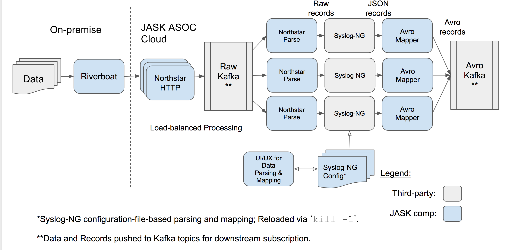

Northstar
==========================

Northstar is an evolved implementation of Lighthouse: JASK's HTTP record ingestion service.

While Lighthouse is based on a combination of nginx, traditional servlets (using Jetty as an
application container and Scalatra as a servlet abstraction), and fixed-size thread pool 
``java.util.concurrent.Executor`` instances, Northstar takes a different approach. It ditches servlets
and nginx in exchange for ``akka-http`` and ``reactive-kafka``. It persists raw records in
Kafka, making the ingest process more durable. And, rather than accept any file, it validates
individual input records in a streaming fashion, rejecting those that don't conform. Uploads
that contain no well-formed messages yield a ``400 Bad Request``. Uploads that contain a mix
yield a ``200 OK``, and contain a response entity that describes good/bad statistics.

Northstar's parser is a full-fledged kafka processor: it takes its input from a net-new raw
message kafka topic (which the HTTP component, described above, writes to) and writes to the same
 ``records`` kafka topic that Lighthouse writes to. This processor primarily wraps ``syslog-ng``,
which does the parse heavy lifting.

Northstar also focuses on other aspects of frontend sophistication: it supports per-key rate
limiting, multi-tenancy, and a ``PUT`` API for idempotent uploads.

It does all this while, at least in the first version, attempting to be API compatible with
Lighthouse. This will make the transition transparent to our users (and will require no sensor
upgrades).

Multi-Tenancy, Authn and Authz
-----------------------------------

Northstar uses HTTP Basic Authentication (just as Lighthouse does). We might
do something more secure (HMAC? HTTPS mutual auth?) later. API keys map to tenants 1:1 (at least
initially).

Rate Management
---------------------------

Northstar implements per-tenant rate management by doing the following.

1. Token Bucket Rate Limiting: a particular tenant will only be allowed to
   sustain an approximate rate as specified by tenant configuration. Each
   Northstar instance will maintain all tenant token bucket states as a
   PNCounterMap, which will converge through cluster gossip.

2. Kafka Partition Provisioning: Northstar will create and widen a particular
   tenant's backing kafka stream to support its configured throughput
   sustained at a global write latency target.

Durability
---------------------------

Northstar's upload APIs stream data into kafka and require that all records
are fully replicated before returning ``200 OK``.

Idempotency
---------------------------

Northstar deals with failed file uploads by offering idempotent retry
semantics. It achieves this by doing the following.

1. Keying all writes from each upload with a UUID.
2. Writing a position-from-start serial counter to each record.
3. Writing a upload-end record message.
4. Returning a 500 on any sort of failure persisting any message.
5. Supporting POST and PUT to a specific UUID. POST generates and return a
   UUID, while PUTs write messages at a particular UUID.

The burden is on the consumer to deduplicate: if a particular consumer sees
an upload "start over" before it completes, it can safely ignore any messages
it has already processed. We pass this burden to the consumer, because Kafka
will ensure per-partition stateful consumption, where tracking per-upload
offset is fairly trivial. Doing it in Northstar, an Akka HTTP service, would
likely require either the help of an external state database or transactional
Kafka writes, both of which complicate things in a service that aims to be
simple.

Formatting
---------------------------

Run `git config core.hooksPath .githooks` from within the repo to have
scalafmt run as a pre-commit hook.

TODO
---------------------------
1. Idempotency
    1. Write a "file done" version of the envelope at the end of a file.
    1. Switch to avro between parse and http modules -- use the confluent schema registry based 
       serializer.
1. Multi-Tenancy
    1. Factor ServiceProvider out of Lighthouse into shared subproject (with
       limited dependencies) so that it can be used elsewhere.
    1. Replace lookupTenant(keyname) with allowAccessToTenant(keyname) in
       ServiceProvider. In lighthouse, since all key names are still
       "api_key", get tenant from host header, fallback to configured default.
    1. Add checkApiKey(keyname, key) to the interface.
    1. Add getAllowedRate().
    1. Add getRawTopic()
1. Rate Limiting.
    1. Initialize Akka Cluster with ZK seed
    1. Build a cluster singleton that fills token buckets on one second ticks.
    1. Build a per-instance bucket manager. Flows can message it to acquire
       the rights to publish some number of messages. It should delay
       if the bucket is empty. It should put back any tokens it didn't use
       when finished.
    1. Integrate the process flow with the token bucket manager.
1. Incremental Cut-over
    1. Implement cloudformation to launch a group of northstar instances.
    1. Point current lighthouse nginx at new infrastructure via proxy_pass.
    1. Measure and configure rates for all customers.

